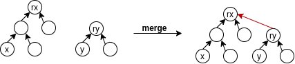
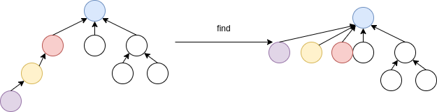

# Silicon-Vallery
How to get a job in Silicon Vallery

目标:2022-12-30完成华为可信认证

## 并查集
1.[关于并查集,你该了解这些](./problem/)

* [684.冗余连接](./problems/0684.冗余连接.md)
* [685.冗余连接II](./problems/0685.冗余连接II.md)


其实最主要的就是并查集只有两种操作:一个是并,一个是查
##### 并查集1.0

```C++
// 并查集的朴素实现,朴素到只需要一个数组就能表示集合,我们用fset[i]表示i所在的集合编号
### 可以把fset数组理解成哈希表,查找过程的时间复杂度为O(1)
### 合并的时候,由于需要遍历fset[i],所以时间复杂度为O(n).图示中简单展示了朴素算法的一个例子,该数组一共记录了四个集合,并且用每个集合的最小数字作为该集合的标识

const int MAXN = 300010;
int fset[MAXN];

void init(int n) {
	for(int i = 1; i <= n; ++i) {
		fset[i] = i;
	}
}

//查
int find(int x) {
	return fset[x];
}

//并
void merge(int x, int y) {
	int rx = find(x), ry = find(y);
	if(rx != ry) {
		for(int i = 1; i <= n; i++) {
			if(fset[i] == rx) {
				fset[i] = ry;
			}
		}
	}
}
```

##### 并查集2.0

// 森林算法
// 用pre[i]表示i在集合树上的父节点,当pre[i]等于i的时候,则表示i为这颗集合树的根节点

```c++
int find(int x) {
	return x == pre[x] ? x : find(pre[x]);
}

void merge(int x, int y) {
	int rx = find(x), ry = find(y);
	pre[ry] = rx;
}
```


在并查集中有两大法宝,一种是**启发式合并**,一种是**路径压缩**
```c++
// 启发式合并
// 为了解决合并过程中树退化为链的情况,用depth[i]标识根为i的树的最大深度,采用最大深度小的向最大深度大的进行合并.这样做的好处是n次操作以后,任何一颗集合树的最大深度都不会超过log(n),所以使得查找的复杂度降为O(log(n)).
int find(int x) {
	return x == pre[x] ? x : find(pre[x]);
}

void merge(int x, int y) {
	int rx = find(x), ry = find(y);
	if(rx != ry) {
		if(depth[rx] == depth[ry]){
			pre[ry] = rx;
			depth[rx]++;
		}else if(depth[rx] < depth[ry]) {
			pre[rx] = ry;
		}else {
			pre[ry] = rx;
		}
	}
}

//路径压缩
//主要是在这个find()中的赋值操作很好地诠释了深度有限搜索在回溯时的完美表现,find()的返回值一定是这颗树的根节点root,回溯的时候会经过从x到root的路径,通过这一步赋值可以很轻松的将该路径上所有节点的父节点都设为根节点root
int find(int x) {
	return x == pre[x] ? x : pre[x] == find(pre[x]);
}
```



```
bool merge(int x, int y) {
	int fx = find(x), int fy = find(y);
	if(fx != fy) {
		pre[fx] = fy;
		return true;
	}
	return false;
}
```

## 贪心算法  
题目分类大纲如下：  

1. [关于贪心算法，你该了解这些!](./problems/贪心算法理论基础.md)